# PROJECTE WEB/APP SOCIAL
**Treball realitzat per Marc Penas i Aleix Povedano.**

## Introducció

### Plantilles del projecte

#### Els nostres colors:
- **VerdClar** | `#606C38`
- **VerdFosc** | `#283618`
- **Beix** | `#FEFAE0`
- **Marró Highlight1** | `#DDA15E`
- **Marró Highlight2** | `#BC6C25`

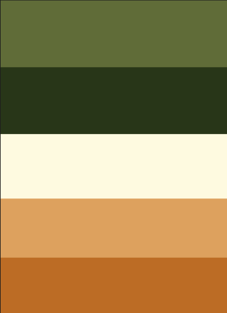

#### Fonts:
- **Ubuntu**

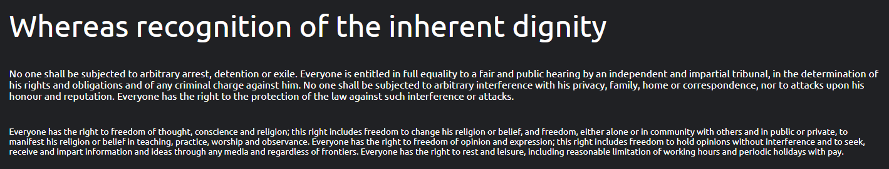

#### Icons:
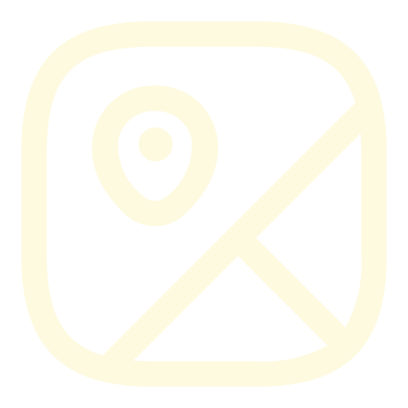  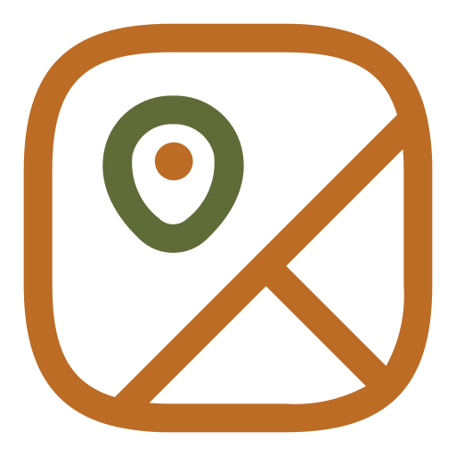 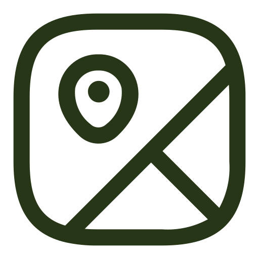 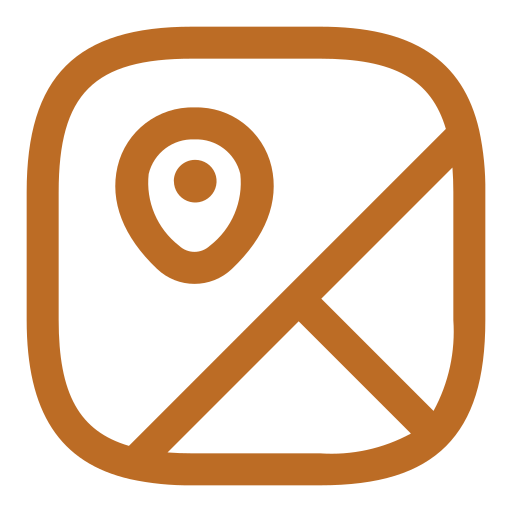  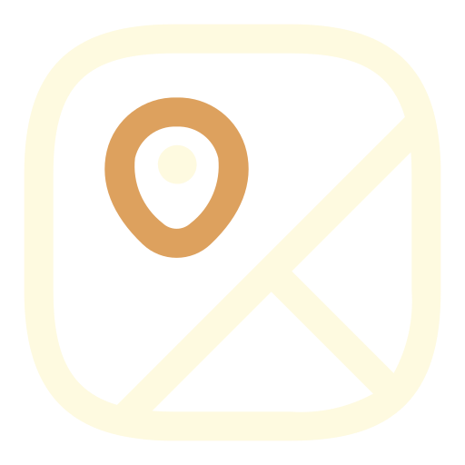
### Decisions preses

#### Display del lloc seleccionat
- La tendència dels dispositius mòbils és que et surtin les dades en vertical, jugant amb displays des de dalt o des de baix (ex: Google Maps).

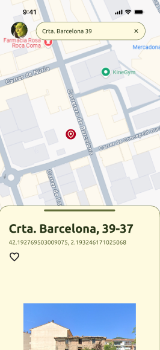
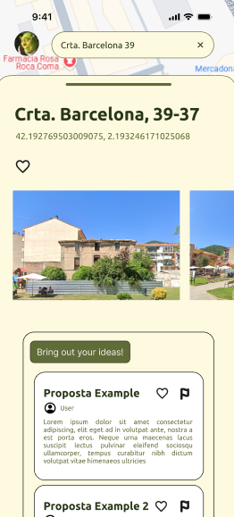

#### Utilització d'objectes geométrics
- S'han agafat els objectes per fer-los arrodonits. D'aquesta manera l'interfície es fa més amigable entre els objectes de l'aplicació.

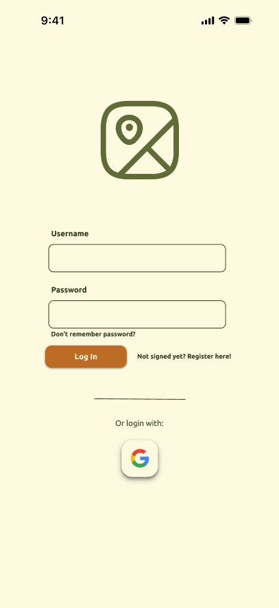
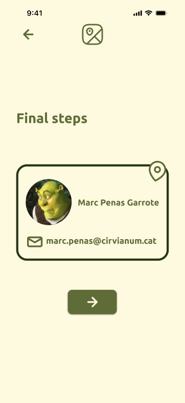
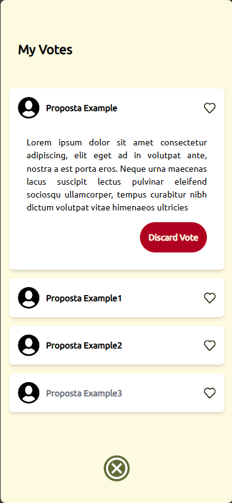

